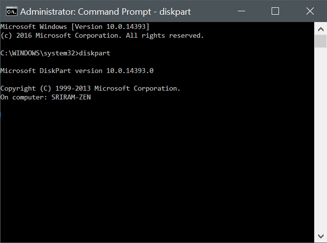

# Corrupt Disk: How to fix when Diskpart or Disk Management will not start on Windows

I recently purchased a Raspberry Pi 3 and wanted to play around with it. After flashing the Raspbian OS onto the MicroSD card using Win32DiskImager, I noticed that it had created two partitions - a 63MiB FAT32 one called `BOOT` and another hidden ext4 one which contained the actual OS.

I wanted to clean up the MicroSD card after playing around, and since Windows does not play nice with ext4, [I searched online and found](https://www.all4os.com/windows/properly-delete-a-partition-on-usb-drive-using-diskpart.html) that the `Diskpart` utility on Windows works well for cleaning up these partitions and restoring my whole card. Yay! That worked as planned and I reinstalled the OS onto the MicroSD card for another run.

On my third attempt however I was a bit careless with using diskpart, and called the `delete partition` command on the ext4 partition instead of just calling the `clean` command on the disk. The window just froze for a while. After waiting for a few minutes, my patience ran out. I killed the diskpart process and tried starting again. Well... it wouldn't start.

